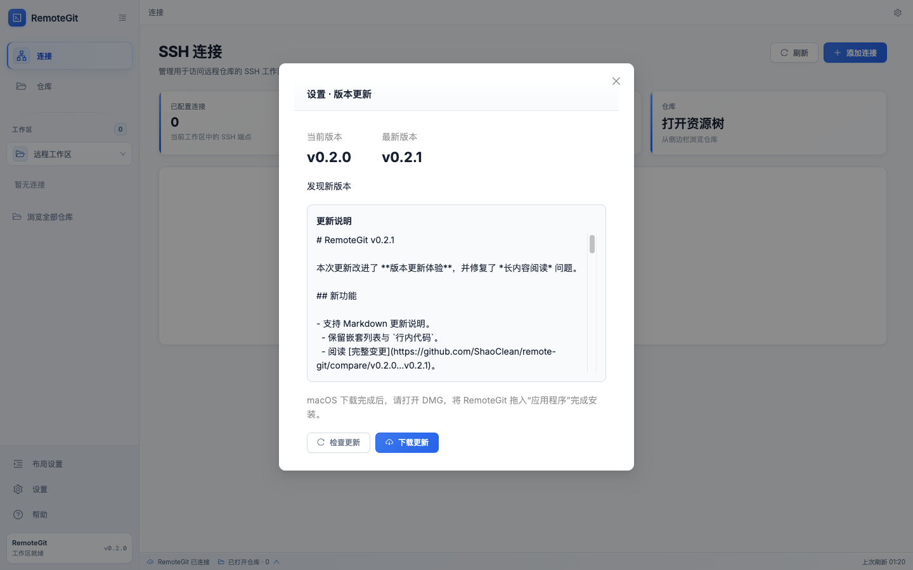
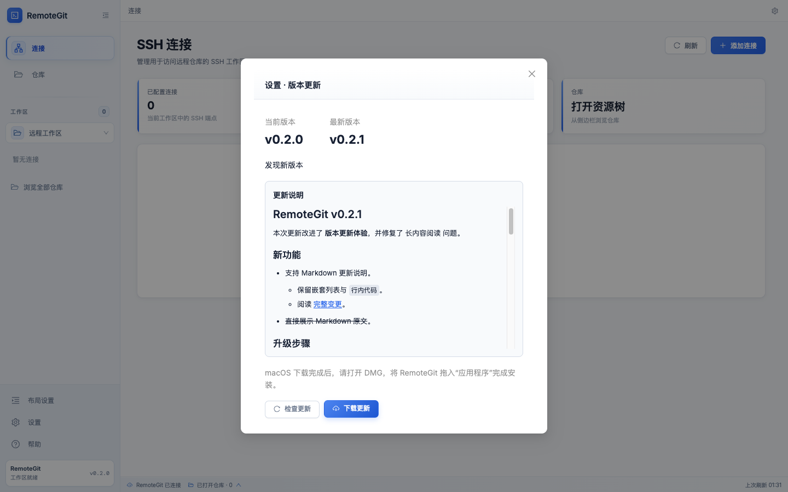
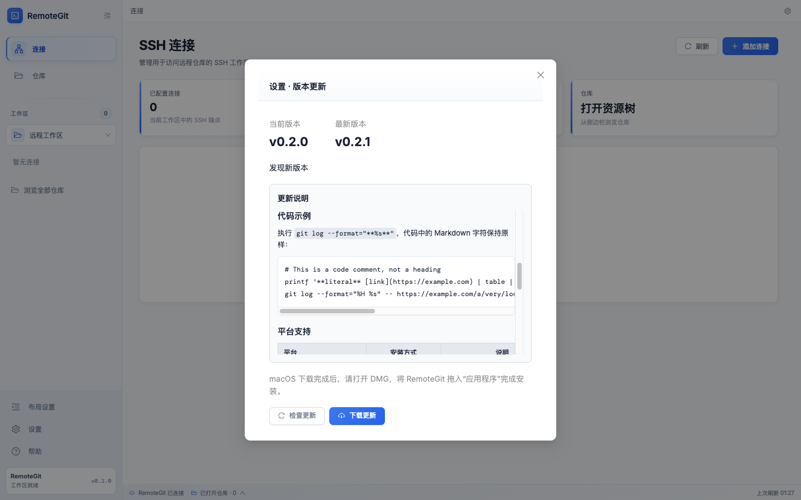
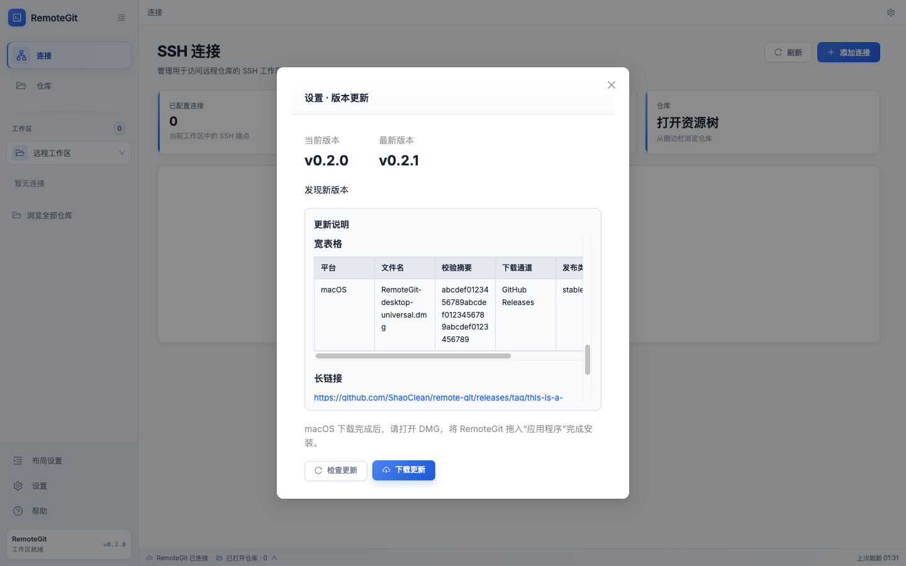
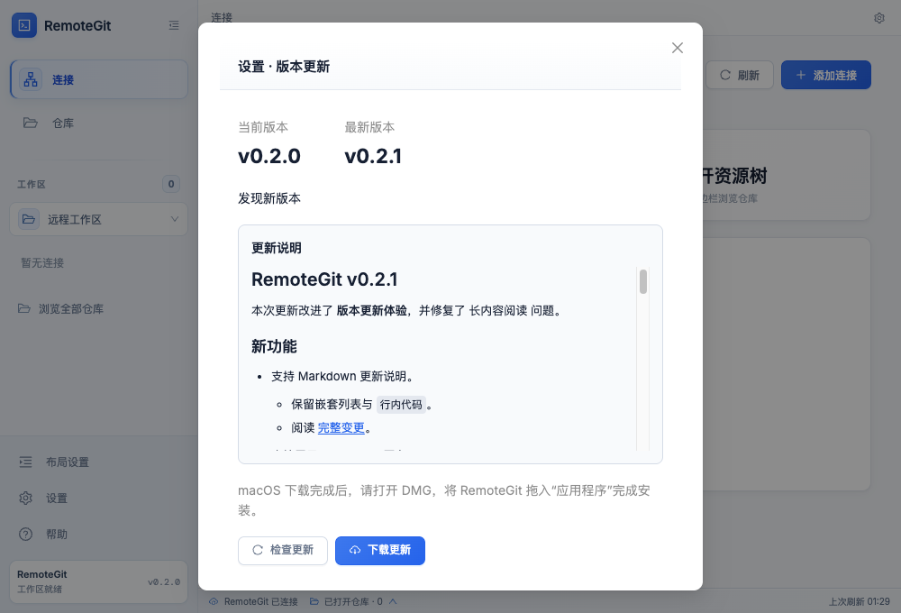

# Issue #13：Markdown 更新说明验收

基线：`origin/development`，提交 `3709357`。远程仓库的开发分支名称为 `development`，没有 `dev` 分支。

环境：macOS arm64、Node.js 25.5.0、npm 11.8.0、Electron 44.2.0；浏览器验收使用 Ego Lite 和生产构建。

## 行为与范围

更新说明使用 `react-markdown` 和 `remark-gfm`，支持标题、段落、嵌套有序/无序列表、强调、引用、行内代码、代码块、表格，以及 GFM 删除线和只读任务列表。

- 忽略原始 HTML；Markdown 图片保留替代文字，不请求远程图片。
- 只允许绝对 HTTP/HTTPS 链接；危险协议、相对路径和页内锚点显示为普通文字。
- 链接使用 `target="_blank"` 和 `rel="noopener noreferrer"`。Electron 主进程再次验证协议后调用系统浏览器，始终拒绝新建应用窗口。
- 说明区域独立纵向滚动，长链接可换行，代码块与宽表格独立横向滚动。颜色使用现有应用 CSS 变量。
- 弹窗居中，在应用最小窗口 `1000×680` 下，版本信息、下载及取消按钮仍可见。
- 空字符串和纯空白保留占位提示；下载进度变化不会重新解析相同的说明。

## 自动化验证

| 检查                              | 结果                                                                          |
| --------------------------------- | ----------------------------------------------------------------------------- |
| `npm test -w web`                 | 34 项通过，含 Markdown/GFM、代码原文、空白、纯文本、HTML、图片和危险/混淆协议 |
| `npm run desktop:test:unit`       | 24 项通过，含系统浏览器协议过滤、打开失败处理及原有更新流程                   |
| `npm run test:hooks`              | 22 项通过                                                                     |
| `npm run test:release-notes`      | 4 项通过                                                                      |
| `npm run desktop:build`           | 5 个构建任务成功                                                              |
| Electron smoke（write + restore） | 通过；验证真实渲染、链接到主进程的路径、下载中刷新、后台关闭与跨进程恢复      |
| `git diff --check`                | 通过                                                                          |

直接在隐藏的 `.worktrees` 路径运行 `npm run desktop:test` 时，现有 Express `sendFile` 的隐藏目录策略使 SPA 回退路由返回 404。将相同 staged app 复制到普通临时目录后，完整 smoke 两阶段通过；没有修改服务器逻辑。可从 worktree 根目录按下列步骤复现：

```sh
npm run desktop:build
TASK_WORKTREE="$PWD"
SMOKE_ROOT="$(mktemp -d /tmp/remote-git-update-smoke.XXXXXX)"
mkdir -p "$SMOKE_ROOT/dist"
cp -R apps/desktop/dist/app "$SMOKE_ROOT/dist/app"
(cd "$SMOKE_ROOT" && node "$TASK_WORKTREE/apps/desktop/scripts/smoke.mjs")
```

## 界面验收

生产构建使用 [更新说明样例](../../../apps/web/tests/fixtures/update-notes.md) 和隔离的更新服务替身：

```sh
npm run build -w @remote-git/shared
npm run build -w web
node apps/web/tests/update-fixture.mjs
```

打开命令输出的地址，进入“设置 → 检查更新”。控制台中的 `window.__updateFixture.set(...)` 可模拟说明内容、下载完成和平台安装模式，`window.__updateFixture.calls` 可核对按钮调用。

[浏览器断言记录](browser-checks.json) 包含以下结果：

- 说明区域宽度与 `scrollWidth` 均为 427 px；外层面板宽度与 `scrollWidth` 均为 472 px，没有横向溢出。
- 代码内容宽 1018 px、容器宽 425 px；宽表格内容宽 577 px、容器宽 427 px；均可独立横向滚动 100 px。
- 滚动说明时，更新操作按钮位置保持不变；`1000×680` 窗口中的按钮底部约为 627 px。
- 空说明、纯空白、普通文本及危险输入通过。危险输入未生成 script、iframe 或 img 元素，脚本执行标记保持为 false，仅安全 HTTPS 链接可点击。
- 实际点击了检查、下载、取消、打开安装包、显示文件位置和重启安装入口，调用顺序与替身记录一致。

| 原界面                       | Markdown 渲染后        |
| ---------------------------- | ---------------------- |
|  |  |

| 代码块                            | 宽表格                           |
| --------------------------------- | -------------------------------- |
|  |  |



## 验证边界

浏览器更新操作使用替身；Electron smoke 拦截系统浏览器调用并使用模拟安装包，不执行真实下载或安装。Windows/Linux 原生运行和真实安装包升级未执行，相关更新服务与适配器由原有单元测试覆盖。

新增解析依赖使前端主包 gzip 从约 381 kB 增至 428 kB；现有依赖版本没有变更。构建保留原有的大 chunk 提示。
