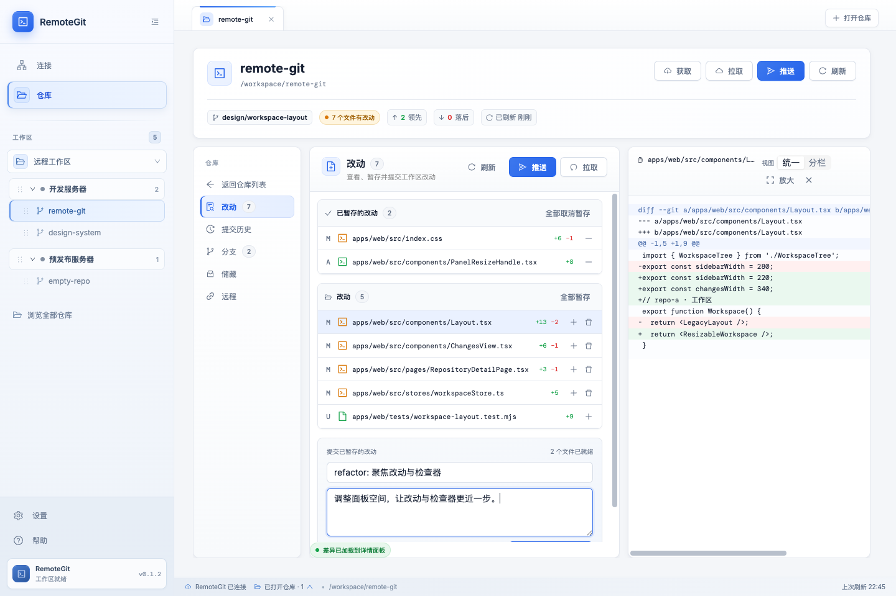
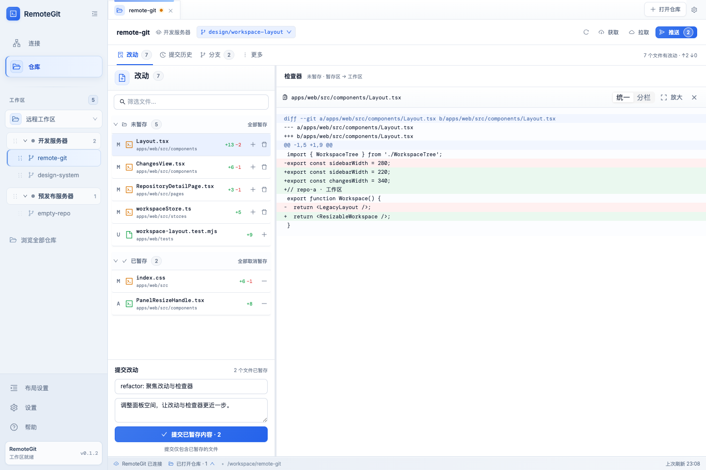
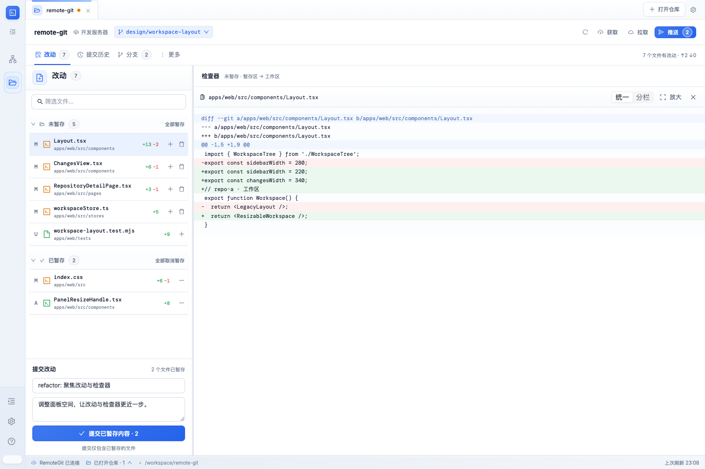
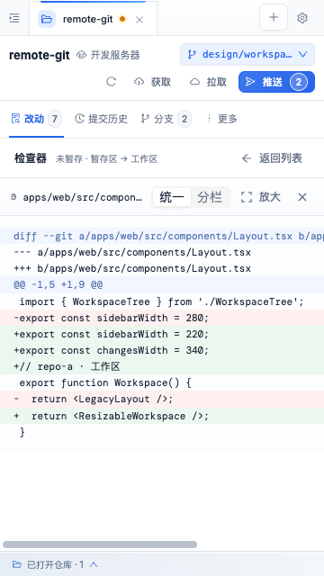
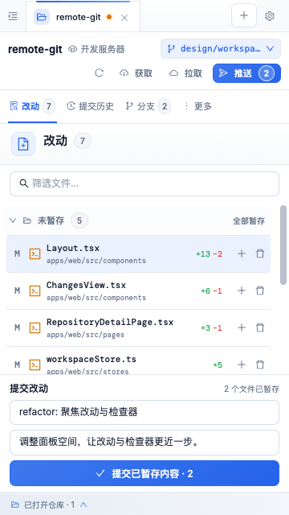

# 工作区布局实现与验收

对应 [Issue #6](https://github.com/ShaoClean/remote-git/issues/6)。正式应用采用紧凑仓库工具栏、横向视图导航、可调宽的改动列表和检查器。视觉稿外层的编号、标题、布局演示切换和“重置演示”不进入产品。

## 使用与兼容

- 默认工作区宽度 220 px、改动列表宽度 340 px；检查器使用剩余空间。
- 工作区可在 184–320 px 调整，收起后为 52 px；改动列表可在 280–520 px 调整，实际可用空间不足时优先保证检查器 360 px。
- 拖动分隔线，或聚焦后使用左右方向键调整 10 px，Shift 加速为 40 px，Home / End 到达当前边界。布局设置也提供滑块与恢复默认入口。
- `Cmd/Ctrl + \` 开关工作区。小于 900 px 时使用临时工作区抽屉，选择文件或提交后进入检查器，返回列表时恢复焦点。Escape 关闭抽屉并返回打开按钮。
- 布局偏好保存到现有 `remote-git-workspace` 的 `state.layout`；保留版本 1 封装，兼容现有 Electron 存储桥及旧树展开、排序数据。缺失或无效字段使用默认值。窗口适配只影响显示，不修改保存的偏好。
- 提交摘要和描述按仓库保留在页面会话内，切换视图、仓库或布局均保留；刷新页面后草稿清空。完成提交只清除对应仓库已提交的草稿。
- Git 操作沿用原接口；暂存状态改变后重新加载所选文件差异。仓库切换会清除检查器，旧仓库的迟到请求或操作完成回调不能覆盖当前仓库。

## 前后对比

截图来自正式应用的生产构建，使用相同的隔离接口数据：1440 × 960、7 个改动文件、选择 `Layout.tsx`，提交草稿相同。测试接口仅改变内存，不连接 SSH，不访问真实仓库。

| 区域         | 修改前          | 修改后       |
| ------------ | --------------- | ------------ |
| 仓库头部高度 | 146 px          | 52 px        |
| 改动面板     | 约 499 × 663 px | 340 × 798 px |
| 检查器       | 约 390 × 663 px | 876 × 798 px |

| 修改前                        | 修改后                       |
| ----------------------------- | ---------------------------- |
|  |  |

| 侧栏收起                     | 窄窗口检查器                                | 短窗口列表与提交区                  |
| ---------------------------- | ------------------------------------------- | ----------------------------------- |
|  |  |  |

## 验证记录

2026-09-10，macOS，Node.js 25.5.0，Chromium / Ego Lite 与 Electron 44.2.0。

| 检查                        | 结果                                                                                                                  |
| --------------------------- | --------------------------------------------------------------------------------------------------------------------- |
| `npm run build -w web`      | TypeScript 检查、生产构建通过；保留原有大 chunk 提示                                                                  |
| `npm test -w web`           | 18 项通过，覆盖旧配置兼容、偏好边界、窗口适配、树排序、存储失败、独立草稿、迟到差异与刷新                             |
| `npm run desktop:build`     | 共享包、SSH 包、后端、前端和桌面应用构建通过                                                                          |
| `npm run desktop:test:unit` | 21 项通过                                                                                                             |
| Electron 两次独立启动 smoke | 通过；保存 310 / 430 px 与收起状态后，在另一进程、另一服务端口恢复，原树排序保持不变                                  |
| 桌面既有流程                | 通过；树折叠、键盘与拖动排序、长列表边缘滚动、取消拖动、更新设置、下载中刷新恢复、存储桥鉴权和关闭后端                |
| 浏览器 Git 操作路由         | 通过；单个与批量暂存 / 取消暂存、提交、获取 / 拉取 / 推送、分支切换；核对测试接口接收的仓库 ID 和参数                 |
| 检查器与输入                | 通过；文件暂存状态与差异同步、提交历史及单文件差异、按仓库保留草稿、切换仓库清除旧差异                                |
| 布局与键盘                  | 通过；拖动分隔线、方向键 / Shift / Home / End、收起与恢复、刷新恢复、恢复默认、窄窗口返回焦点、抽屉 Escape 与焦点返回 |
| 尺寸                        | 检查 1440 × 960、980 × 760、900 × 800、820 × 800、390 × 844、360 × 640；无整体横向溢出，360 × 640 时提交按钮完整可用  |

桌面 smoke 的构建产物复制到临时普通目录执行：本地 worktree 位于 `.worktrees` 隐藏目录，现有 Express `sendFile` 会忽略该路径中的静态文件。测试使用隔离用户数据，不触碰个人连接和配置。

后端现有 Jest 命令受 TypeScript `rootDir` 配置影响。临时指定测试编译配置后，本分支与基线 `ecd17b0` 均为 1 项通过、8 项失败，失败原因均为脚手架测试未注册 controller / service 的依赖。本次没有修改后端实现或这些测试。

未运行 Windows / Linux 原生安装包验收和真实远程 SSH 的写操作。接口回归使用内存测试数据，Electron smoke 验证实际桌面进程和持久化。

## 复现浏览器验收

```sh
npm run build -w web
node apps/web/tests/workspace-fixture.mjs
```

访问命令输出的本机地址并进入 `/repositories/repo-a`。另有 `repo-b` 和 `empty` 用于草稿隔离及空状态检查；`/__fixture/actions` 可查看收到的操作。测试服务只绑定 `127.0.0.1`，测试文件不会被前端打包。
