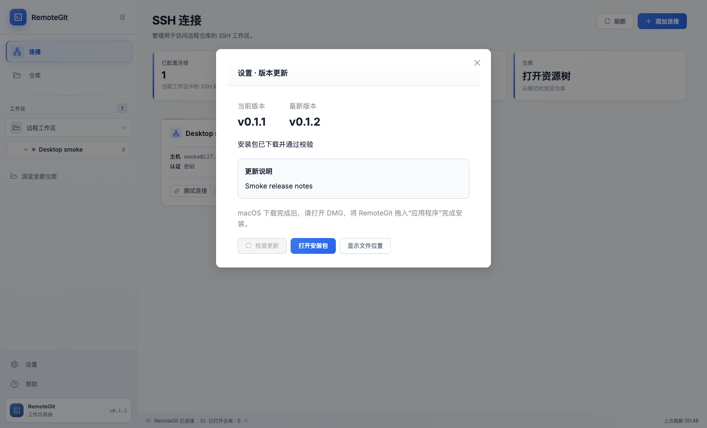
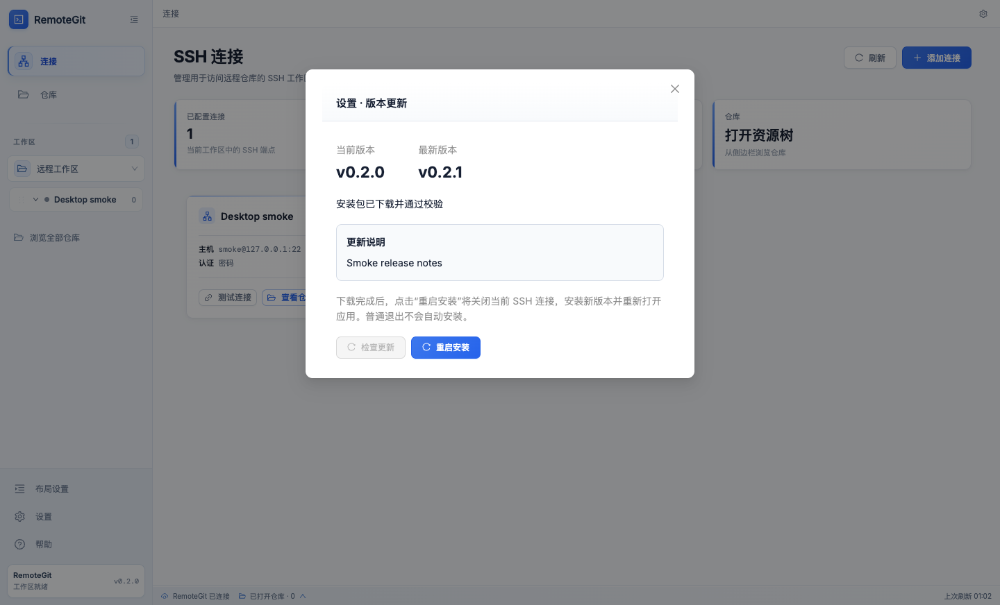

# macOS 重启安装验证

日期：2026-09-11。环境：macOS 15.5 / arm64、Node.js 25.5.0、Electron 44.2.0。

关联：[Issue #12 — 更新下载完成后支持一键重启安装，无需手动重新安装](https://github.com/ShaoClean/remote-git/issues/12)，跟踪于[公开 TODO 看板](https://github.com/users/ShaoClean/projects/1)。本记录覆盖实现及本地验证，正式安装包的跨平台升级验收仍待完成。

下载校验完成后，macOS 与 Windows/Linux 一样显示“重启安装”。点击后先重新校验 DMG、检查安装目录并准备新应用，再关闭本地服务。安装程序等待旧进程退出后替换应用并重新打开。替换或启动命令失败时尝试恢复原应用；恢复失败会保留备份及恢复位置。

| 验证 | 结果 |
| --- | --- |
| `npm run desktop:test:unit` | 35 项通过，包含安装顺序、重复点击、损坏/删除安装包后重新下载、目录不可写、后端关闭失败/超时、安装程序启动失败、替换失败、启动命令失败、退出超时和备份保留 |
| macOS 原生安装集成测试 | 隔离的 Mach-O 测试应用从 1.0.0 升级到 1.1.0：实际创建和挂载 DMG、复制并验证应用、等待旧进程退出、替换应用、通过系统 `open` 启动新版本；新进程写出的版本标记正确，独立数据目录中的测试设置保留 |
| `npm run desktop:build` | TypeScript/Vite、桌面暂存和 Electron SQLite 模块重建通过 |
| `node scripts/smoke.mjs`（`apps/desktop` 目录） | 实际 Electron 界面下载完成后出现“重启安装”；刷新保留更新状态；点击按钮只触发一次模拟安装并关闭活跃 WebSocket 和后端；工作区跨进程恢复通过 |
| 本地 macOS arm64 打包及 `node apps/desktop/scripts/test-packaged.mjs` | 打包后的应用通过相同界面、IPC、服务关闭和持久化回归。日志中的无效 `workspace:save` 请求是既有鉴权/输入校验测试的预期错误 |
| 界面截图 | 已检查按钮和提示文案，无截断或重叠 |

本地打包复用已下载的 Electron 44.2.0，从仓库根目录运行 `npm run pack -w desktop -- --config.electronDist="$PWD/node_modules/electron/dist"`。产物位于 `apps/desktop/release/mac-arm64/RemoteGit.app`，版本号仍为 0.2.0，包含未发布的本次改动。

截图均使用隔离测试数据。改动前来自已有的 0.1.1 暂存构建，改动后来自本次打包的 0.2.0 构建；图中“最新版本”和更新说明为模拟数据。

尚未验证：macOS x64 实机升级、Windows/Linux 实机安装，以及从公开 Release 下载两个正式 RemoteGit 版本后的完整升级。原生集成测试使用小型测试应用，桌面界面测试使用模拟安装器；这些结果不能替代正式 Electron 安装包的升级验收。系统 `open` 成功受理后发生的应用内部崩溃不在自动恢复范围内。

本次没有替换用户已安装的应用、修改现有用户数据、配置开发者签名/公证或发布 Release。已有手动更新版本需要先安装包含本功能的版本，后续才能使用“重启安装”。
